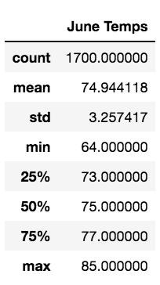
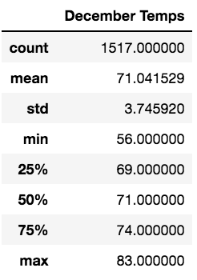

# Surfs Up!
## Overview of the project

For this project we are looking into opening a Surf ‘n Shake shop in Hawaii. After drawing up the business plan and presenting it to a panel of investors, we have enlisted the help of W. Avy, a famous investor known to have a love of surfing. W. Avy is on board to help open up the Surf ‘n Shake shop but has one major concern, the weather. Listed below is the weather analysis conducted on Owahu, where we analyzed trends, created graphs to analyze precipitation trends, and from which stations the precipitation is collected. After all of this data has been collected, this was compiled into a Flask app to ensure that our investors can easily access all of our analysis. In preparation for the final investor meeting, W. Avy is requesting the temperature data for the months of June and December in Oahu, in order to determine if the surf and ice cream shop business is sustainable year-round.

## Results for June: 

Listed below are the summary statistics for the month of June:

* The standard deviation is relatively small which means the temperatures tend to be closer to the mean of 74 degrees.

* This idea is again expressed in the quartiles as they are also very close.

## Results for December: 

Listed below are the summary statistics for the month of December:

* The mean temperature for June and December are fairly close, which is a great sign indicating that business will survive the coldest month in the winter season.

## Summary: 

Overall the data supports opening the Surf ‘n Shake year-round. In addition to this data, I would query the average daily temperature in a specific day for months of June and December to help predict promotional events or sales. Another query I'd run would be which days are to be the coldest in the month of December to note which days are not worth opening the store due to the weather. 

